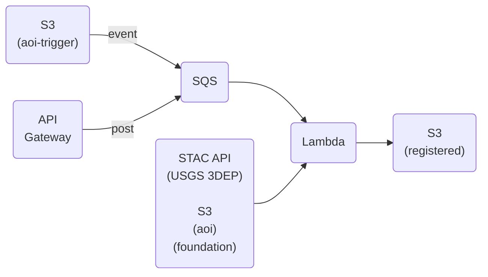

# cloud-coreg

An AWS implementation of [CODEM](https://github.com/NCALM-UH/CODEM), a tool for 3D data coregistration.

CODEM spatially solves and applies a six or seven degree of freedom transformation to register a 3D area of interest (AoI) dataset to a 3D foundation dataset. The AoI and foundation datasets can be a digital surface model (DSM), point cloud, or mesh product. Refer to [CODEM](https://github.com/NCALM-UH/CODEM)'s documentation for supported formats.

## The general flow



## Deploying

You will need [cdk](https://docs.aws.amazon.com/cdk/v2/guide/getting_started.html#getting_started_install) installed and [bootstrapped](https://docs.aws.amazon.com/cdk/v2/guide/getting_started.html#getting_started_bootstrap).

1. Populate the `bucket_prefix` field in the `context` object in the [cdk.json](cdk.json) file. The prefix is used to create simple s3 bucket names (as opposed to the complex default names assigned by CloudFormation) to ease data transfer via the [AWS CLI](https://awscli.amazonaws.com/v2/documentation/api/latest/reference/s3/cp.html). The bucket names will be::

    - <bucket_prefix>-aoi
    - <bucket_prefix>-aoi-trigger
    - <bucket_prefix>-foundation
    - <bucket_prefix>-registered

2. Run `cdk deploy --outputs-file cdk-outputs.json`. The physical names of the buckets and the API URL will be output to the terminal and saved to the `cdk-outputs.json` file. Note that you must append `coregister` to the API URL when making a coregister API call.

## Running

There are two ways to kick off a `cloud-coreg` run:

1. **Simple:** Copy an AoI file to the trigger bucket

    Copy an AoI file to the `<bucket_prefix>-aoi-trigger` bucket. This will pull foundation data from the [Planetary Computer](https://planetarycomputer.microsoft.com/)'s USGS 3DEP digital surface model holdings and run CODEM with all [parameters](https://github.com/NCALM-UH/CODEM/blob/main/docs/configuration.md) set to their defaults.

    ```shell
    $ aws s3 cp tests/data/AOI-DigitalSurfaceModel.tif s3://myprefix-aoi-trigger
    ```

2. **Flexible:** Make an API call with optional parameters

    Upload an AoI file to the `<bucket_prefix>-aoi` bucket. Optionally upload a Foundation file to the `<bucket_prefix>-foundation` bucket. POST a message to the API Gateway.

    ```shell
    $ aws s3 cp tests/data/0_smallfnd.tif s3://myprefix-foundation
    $ aws s3 cp tests/data/1_smallAOI.tif s3://myprefix-aoi
    % curl -X POST -H "Content-Type: application/json" -d '{"fndFile": "0_smallfnd.tif", "aoiFile": "1_smallAOI.tif"}' https://xxxxxxxxxx.execute-api.us-east-1.amazonaws.com/test/coregister
    # { "Enqueued": "True" }%
    ```
    
    Valid message values are:

    - `aoiFile`: Name of a file in the `<bucket_prefix>-aoi` bucket. (required)
    - `fndFile`: Name of a file in the `<bucket_prefix>-foundation` bucket. If not supplied, foundation data will be pulled from the Planetary Computer's USGS 3DEP DSM holdings. (optional)
    - `fndBufferFactor`: Factor by which to scale the AoI boundary when cropping the Foundation data. Accounts for existing mis-registration between the AoI and Foundation data. [default=2] (optional)
    - `codemMinResolution`: CODEM's minimum resolution (in meters) parameter. [default=2] (optional)
    - `codemSolveScale`: CODEM's solve scale parameter. [default=True] (optional)

## Accessing the registration results

In both cases the registered AoI will be saved to the `<bucket_prefix>-registered` bucket in a directory named `<aoi_file_name>-registered-<timestamp>`. For example, if you ran a coregistration with the AOI-DigitalSurfaceModel.tif file, you can see the created directory by listing the contents of the registered bucket:

```shell
$ aws s3 ls s3://myprefix-registered
# PRE AOI-DigitalSurfaceModel-registered-2023-02-05_13-14-52/
```

```shell
$ aws s3 ls s3://myprefix-registered/AOI-DigitalSurfaceModel-registered-2023-02-05_13-14-52/
# 2023-02-05 08:15:01     735778 AOI-DigitalSurfaceModel_registered.tif
# 2023-02-05 08:15:01        546 config.yml
# 2023-02-05 08:15:01     497805 dsm_feature_matches.png
# 2023-02-05 08:15:01       1228 registration.txt
```

Copy the results to a local directory:
```shell
$ aws s3 cp --recursive s3://myprefix-registered/AOI-DigitalSurfaceModel-registered-2023-02-05_13-14-52/ ./results
# download: s3://myprefix-registered/AOI-DigitalSurfaceModel-registered-2023-02-05_13-14-52/registration.txt to results/registration.txt
# download: s3://myprefix-registered/AOI-DigitalSurfaceModel-registered-2023-02-05_13-14-52/config.yml to results/config.yml
# download: s3://myprefix-registered/AOI-DigitalSurfaceModel-registered-2023-02-05_13-14-52/dsm_feature_matches.png to results/dsm_feature_matches.png
# download: s3://myprefix-registered/AOI-DigitalSurfaceModel-registered-2023-02-05_13-14-52/AOI-DigitalSurfaceModel_registered.tif to results/AOI-DigitalSurfaceModel_registered.tif
```
