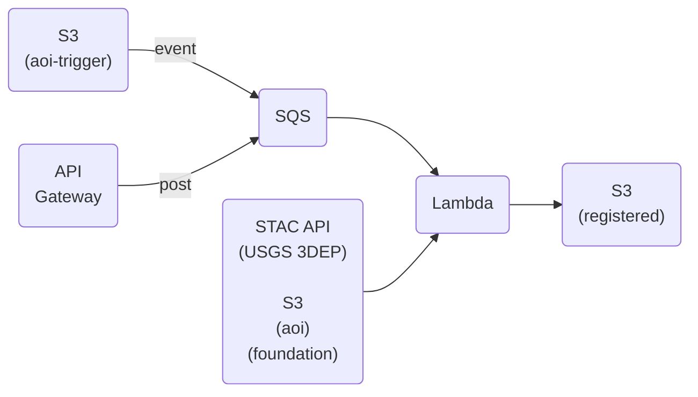

# cloud-coreg

An AWS implementation of [CODEM](https://github.com/NCALM-UH/CODEM), a tool for 3D data co-registration.

CODEM spatially registers an Area of Interest (AoI) 3D data file to a Foundation 3D data file. The AoI and Foundation data can be a digital surface model (DSM), point cloud, or mesh product. Refer to [CODEM](https://github.com/NCALM-UH/CODEM)'s documentation for supported formats.

## The general flow

## Process kick-off

There are two ways to kick off a `cloud-coreg` run:

1. **Super simple**

    Upload an AoI file to the `aoi-trigger` bucket. This will pull foundation data from the [Planetary Computer](https://planetarycomputer.microsoft.com/)'s USGS 3DEP digital surface model holdings and run CODEM with all [parameters](https://github.com/NCALM-UH/CODEM/blob/main/docs/configuration.md) set to their defaults.

2. **Flexible**

    Upload an AoI file to the `aoi` bucket. Optionally upload a Foundation file to the `foundation` bucket. Post a message to the API Gateway. Valid message values are:
    - `aoiFile`: Name of a file in the `aoi` bucket. (required)
    - `fndFile`: Name of a file in the `foundation` bucket. If not supplied, foundation data will be pulled from the Planetary Computer's USGS 3DEP DSM holdings. (optional)
    - `fndBufferFactor`: Factor by which to scale the AoI boundary when cropping the Foundation data. Accounts for existing mis-registration between the AoI and Foundation data. [default=2] (optional)
    - `codemMinResolution`: CODEM's minimum resolution parameter. [default=1m] (optional)
    - `codemSolveScale`: CODEM's solve scale parameter. [default=True] (optional)
